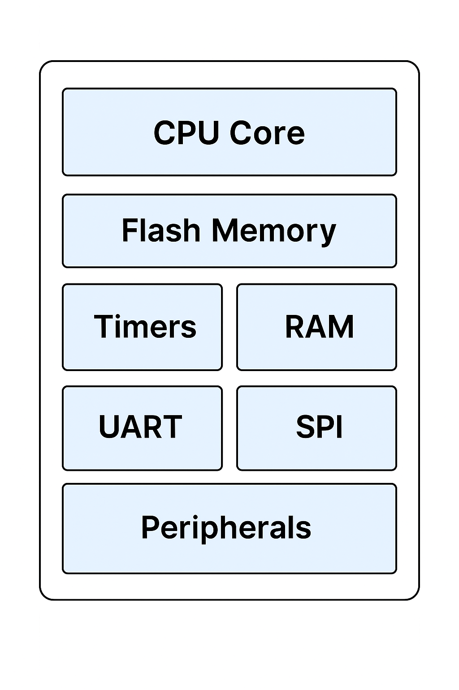

# Chapter 1: Introduction to Microcontrollers & PIC24FJ64GA002

## Section 1: What is a Microcontroller?

A **microcontroller** is a compact, self-contained computer system built onto a single integrated circuit. It includes:

- A **CPU** (Central Processing Unit)
- **Memory** (Flash and RAM)
- A set of **peripherals** (I/O ports, timers, ADCs, serial comms)

These components allow the microcontroller to **interact with the real world** — sensing, computing, and controlling things like motors, lights, sensors, and displays.

---

### 📦 Microcontroller Block Diagram

The diagram below shows a typical microcontroller architecture.

  

As shown:
- The CPU communicates with peripherals through buses
- Modules like UART, SPI, ADC, and timers are all built-in
- Flash stores the program, and RAM stores runtime variables

> 🧠 Unlike general-purpose computers, microcontrollers are built for **dedicated control tasks** — not multitasking or user interaction.

---

### ✅ Key Characteristics

- 🔹 **Small footprint**: Ideal for embedded systems with limited space
- 🔹 **Real-time responsiveness**: Handles time-sensitive tasks predictably
- 🔹 **Integrated I/O**: No need for external chips to communicate
- 🔹 **Low power**: Great for battery-powered devices
- 🔹 **Cost-effective**: Perfect for mass production and consumer products

---

Microcontrollers are the foundation of most embedded systems — from smart home devices to industrial automation.

## Section 2: Overview of the PIC24FJ64GA002

For this textbook, we’ll be working with the **PIC24FJ64GA002**, a 16-bit microcontroller developed by Microchip.

This device strikes a great balance between simplicity and power — making it ideal for students and embedded systems developers alike.

---

### 🔍 Key Features

| Feature             | Value                         |
|---------------------|-------------------------------|
| Core                | 16-bit modified Harvard        |
| Clock Speed         | Up to 32 MHz                  |
| Program Flash       | 64 KB                         |
| RAM                 | 8 KB                          |
| I/O Pins            | 21                            |
| Timers              | 5 (16-bit and 32-bit capable) |
| ADC Channels        | 10-bit, 13 input channels      |
| UART / SPI / I2C    | 2 UARTs, 2 SPI, 1 I2C          |

> 📎 Datasheet Reference: [PIC24FJ64GA002 Datasheet (Microchip)](https://ww1.microchip.com/downloads/en/DeviceDoc/39881D.pdf)

---

### 🧠 Why This Chip?

- Widely supported in **MPLAB X IDE** and the **XC16 compiler**
- Features common **peripherals** used in real-world systems
- Has **enough complexity** to teach important concepts without being overwhelming
- **Low-cost** and easy to prototype with (available on dev boards)

---

You’ll see this microcontroller referenced throughout the book — from I/O programming to advanced peripheral control.

## Section 3: The Development Environment

To write, compile, and test code for the PIC24FJ64GA002, we use Microchip’s official toolchain:

---

### 💻 MPLAB X IDE

**MPLAB X** is an Integrated Development Environment (IDE) that supports Microchip’s entire family of devices, including PIC24.

- Features project management, code editing, and debugger integration
- Runs on Windows, macOS, and Linux
- Allows simulation, breakpoints, memory inspection, and more

> 🔗 Download: [MPLAB X IDE – Microchip](https://www.microchip.com/en-us/tools-resources/develop/mplab-x-ide)

---

### ⚙️ XC16 Compiler

Microchip’s **XC16** is a C compiler tailored for 16-bit devices like the PIC24 family.

- Converts your C code into binary `.hex` files for flashing
- Works directly inside MPLAB X
- Supports optimization levels for size, speed, and debugging

> 🛠️ In this book, we’ll stick to **C and inline assembly** where needed — all compiled using XC16.

---

### 🧪 Simulators and Debuggers

You can:
- Simulate logic (LEDs, registers, timing) using MPLAB’s built-in simulator
- Flash code to real hardware using tools like **PICkit 3/4** or **Curiosity boards**

Later in this book, we’ll introduce **MicroSims** — small, interactive simulations designed to visualize how code affects hardware behavior.

---

With this toolchain installed, you're ready to start building and debugging embedded systems with confidence.

## Section 4: Embedded vs General-Purpose Programming

Programming a microcontroller is **very different** from writing software for a desktop or smartphone.

While general-purpose computers focus on speed, user interaction, and multitasking, **embedded systems** are designed for **deterministic control of hardware** — often under tight resource constraints.

---

### 💻 General-Purpose Programming (e.g., Python, Java)

- Focus on **user experience** and **abstraction**
- Often use **operating systems** for multitasking and memory management
- Can be inefficient — memory and CPU are plentiful

---

### 🤖 Embedded Programming (e.g., C, Assembly)

- Runs **bare-metal** or with minimal OS support
- Must manage **timing, memory, and power** directly
- Designed for real-world interaction: controlling motors, reading sensors, etc.
- Emphasis on **efficiency and predictability**

---

| Concept            | Embedded Systems         | General-Purpose Systems     |
|--------------------|---------------------------|------------------------------|
| Environment        | Real-time, resource-constrained | OS-managed, multi-user      |
| Timing             | Deterministic, cycle-aware       | Flexible, best-effort       |
| Language           | C / Assembly                     | Java, Python, C#            |
| Use Cases          | Thermostats, robots, sensors      | Web apps, spreadsheets, games |

> ⏱️ In embedded systems, a **missed deadline** or **unexpected delay** can cause system failure — timing is everything.

---

Throughout this textbook, we’ll write tight, predictable C and assembly code that gives us **precise control over the hardware**.

## Section 5: Summary and Use Cases

Let’s review the key points from this chapter:

---

### 🧠 Core Ideas

- A **microcontroller** is a self-contained system with a CPU, memory, and peripherals built into one chip
- The **PIC24FJ64GA002** is a 16-bit MCU with timers, ADCs, communication modules, and 64 KB of Flash
- Development is done using **MPLAB X IDE** and the **XC16 compiler**
- Embedded programming focuses on **predictability**, **efficiency**, and **hardware interaction**

---

### 🔌 Where Are Microcontrollers Used?

| Use Case                | Example Devices                         |
|--------------------------|------------------------------------------|
| Consumer Electronics     | Thermostats, smart watches, toys         |
| Automotive               | Airbags, ABS controllers, key fobs       |
| Industrial Automation    | Motor drivers, temperature sensors       |
| Medical Devices          | Heart monitors, insulin pumps            |
| Robotics & Prototyping   | Line-following robots, drones            |

---

> 🔍 As you go through this book, you’ll develop the **low-level control skills** that make these devices possible — starting from the very first line of assembly code.

### 🧠 Quiz: Microcontroller Fundamentals

Which of the following is **true** about microcontrollers?

1. They require an operating system to function  
2. They are mainly used for high-performance graphics  
3. They integrate a CPU, memory, and peripherals on one chip  
4. They must be connected to the internet to work  

??? question "Show Answer"
    The correct answer is **C**.

    Microcontrollers are self-contained systems with a CPU, RAM, Flash, and I/O peripherals — all integrated onto one chip.  
    They are designed for **dedicated, low-power control tasks**, not general-purpose computing.

---

### ✍️ Prompt Practice

Think of an everyday device that uses a microcontroller (e.g., microwave, car key fob, thermostat).  
How might that microcontroller interact with the real world?

Write a short description answering the following:

- What is the microcontroller sensing?
- What outputs or devices does it control?
- Why is a microcontroller useful in this case?

??? example "Click to show example"
    **Smart Thermostat**

    - **Senses** room temperature using a digital temperature sensor  
    - **Controls** the HVAC system by turning heating/cooling on or off  
    - **Microcontroller use**: Performs decisions based on user input and sensor data. Communicates with Wi-Fi to support remote control.
